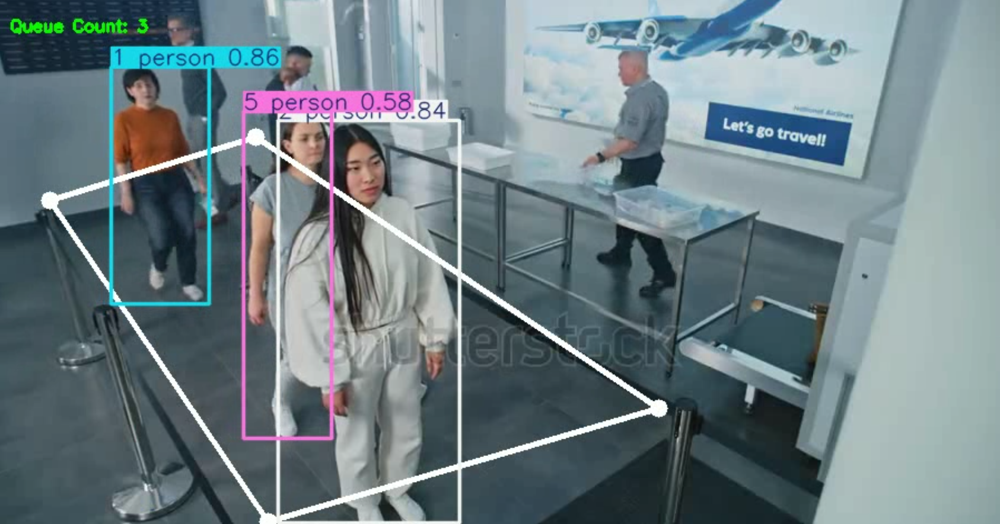
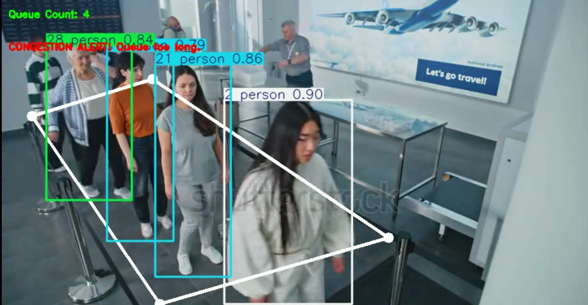
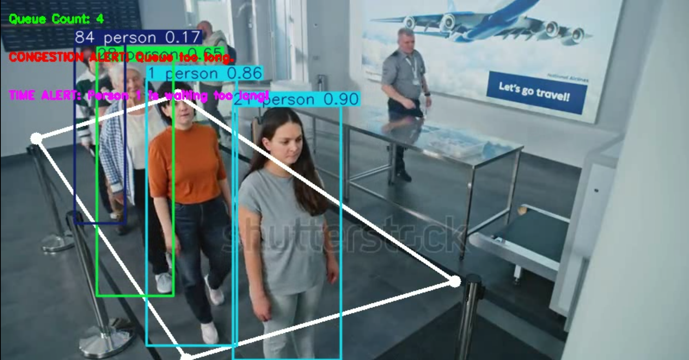

# Modified-Queue-Management-with-Ultralytics

Two Python utilities for counting and monitoring people in a queue from video, and for interactively selecting the queue region from a frame.

- `queue_management.py` — real-time queue counting, dwell-time alerts and congestion alerts using an Ultralytics model and tracking.
- `gui_selection_of_queue_region.py` — simple Tkinter GUI to pick four points (Top-Left, Top-Right, Bottom-Right, Bottom-Left) from a video frame and print the coordinates.

---

## Requirements

- Python 3.8+
- Packages:
  - numpy
  - opencv-python
  - pillow
  - ultralytics
  - tkinter 

Install dependencies:
```bash
pip install numpy opencv-python pillow ultralytics
```

---

## queue_management.py

Purpose:
- Runs a YOLO-based detector/tracker to count people inside a polygonal queue region.
- Shows queue count on frames.
- Emits alerts:
  - Congestion alert when count > threshold.
  - Dwell-time alert when a tracked person stays in the region longer than configured seconds.

Important variables to update before running:
- `process_video(video_path="example_video.mp4", output_path="output.mp4")` — change paths as needed.
- `queue_region` — list of 4 (x, y) tuples defining the polygon. Example format:
  ```
  queue_region = [(217, 288), (342, 436), (562, 225), (455, 147)]
  ```
  Use the GUI script to get these coordinates and copy them here.
- `model="yolo11n.pt"` — path to your Ultralytics model. Update to your model path.

Run:
```powershell
python queue_management.py
```

Output:
- Annotated output video saved to `output_path`.
- A window showing the processed video (press `q` to quit).

Notes / Troubleshooting:
- If `cv2.VideoCapture` fails, verify the video path and codecs.
- Ensure the model file exists and ultralytics is correctly installed.

---

## gui_selection_of_queue_region.py

Purpose:
- Open a file dialog to select a video.
- Display first frame in a scrollable canvas.
- Click four points in order: Top-Left, Top-Right, Bottom-Right, Bottom-Left.
- Click "Create Region" to finalize. Coordinates are printed to the console.

Run:
```powershell
python gui_selection_of_queue_region.py
```

Usage:
1. Click "Upload Video".
2. Click on the image in order to place 4 points.
3. Click "Create Region".
4. The 4-point coordinates will be printed to the terminal. Copy them into `queue_management.py` as `queue_region`.

Notes:
- The GUI displays the image at original resolution with a vertical scrollbar when needed.
- If you see no image, verify OpenCV can read the video and that the video codec is supported.

---

## Typical workflow

1. Run `gui_selection_of_queue_region.py`.
2. Upload the video and pick 4 points for the queue polygon.
3. Copy printed coordinates.
4. Paste coordinates into `queue_management.py` `queue_region` variable.
5. Update model path and output path as needed.
6. Run `queue_management.py` to process the whole video.

---

## Example
- After selecting points in the GUI you might see:
```
Queue region points: [(217, 288), (342, 436), (562, 225), (455, 147)]
```
- Paste that list into `queue_management.py`:
```python
queue_region = [(217, 288), (342, 436), (562, 225), (455, 147)]
```

---

## Example output

Below are sample annotated frames from the processed video:






## Notes & Tips
- Coordinates are pixel coordinates relative to the frame used in the GUI (first frame).
- For production use, consider adding CLI args or a config file for paths, model, device and thresholds.
- If using a GPU, ensure CUDA and drivers match the PyTorch / ultralytics build.
